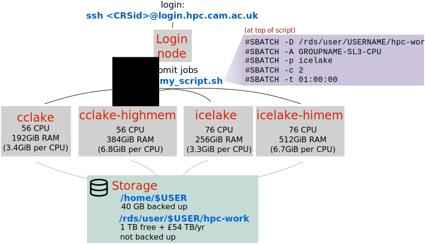

## CSD3

Here is a schematic summary of the university HPC:

There are two main storage locations of interest available on the HPC:

- `/home/$USER` is the user's home directory. It has a 40GB quota and is backed up. This should be used for example for local software and perhaps some very generic scripts.
- `/rds/user/$USER/hpc-work` is the user's working directory. It has a 1TB quota and is _NOT_ backed up (more space [can be purchased](https://www.hpc.cam.ac.uk/research-data-storage-services/price-list)).

When you login to the HPC you will notice there is a link (aka shortcut) to the `rds` directory. Try `ls -l` to see it.

<!--
[Note: there's also a shortcut to `/rcs/user/$USER`. This is access to "cold storage", which is the long-term slow-access storage provided by the university. Most likely you will not be using this unless you want to access/deposit archival data.]
-->

### Default Resource Options

If you don't specify some of the options listed above, this is the default you will get:

- 10 minutes of running time (`-t 00:10:00`)
- _skylake_ partition (`-p skylake`)
- 1 CPU (`-c 1`)
- 5980MB RAM (`--mem=5980MB` or `--mem-per-cpu=5980MB`)

**Tip - test your jobs faster:**

`#SBATCH --qos=intr` option can be used when _testing_ scripts. This will allocate a maximum of 1h to your job in the highest priority queue. Only one of these jobs is allowed to run at a time and after the 1h the job will be killed, so it should only be used for _testing_ scripts.

#### Long Jobs

As a standard you are limited to 12h for jobs on the University HPC. Long jobs (up to 7 days) can be run on special queues, for which you need to request access. See instructions on the [documentation page](https://docs.hpc.cam.ac.uk/hpc/user-guide/long.html).

#### Billing

The billing on the University HPC is done by CPU-hour. Here's some examples:

- You requested 3 CPUs (`-c 3`) and 10 hours (`-t 10:00:00`). Your job only took 2 hours to finish. You are charged 3*2 = 6 hours of compute time.
- You requested 1 CPU (`-c 1`) and 15000MB of total RAM (`--mem=15000MB`) on _skylake-himem_ (`-p skylake-himem`), and the job took 1 hour to run. Because this partition provides 12030MB per CPU, you will actually be charged for 2 CPUs, so 2*1 = 2 hours of compute time.

If you're using a SL3 account (free), your allowance is capped. Each PI receives 200,000 CPU hours per quarter.

#### Additional resources:

- UIS documentation:
  - [Filesystem](https://docs.hpc.cam.ac.uk/hpc/user-guide/io_management.html)
  - [File transfer](https://docs.hpc.cam.ac.uk/hpc/user-guide/transfer.html)
  - [Running jobs](https://docs.hpc.cam.ac.uk/hpc/user-guide/batch.html)
  - [Billing policies](https://docs.hpc.cam.ac.uk/hpc/user-guide/policies.html)
- [Price list for HPC storage](https://www.hpc.cam.ac.uk/research-data-storage-services/price-list)

## Other Departments

- CRUK: https://bioinformatics-core-shared-training.github.io/hpc/
- SLCU: https://gitlab.com/slcu/computing/hpc-cam-intro/ 
- 

